# **Comparing men and women penalties in the latest two World Cups and European Championships**

## **Introduction**

This study aims to find out whether there are differences in how men and women take penalties in some recent major international tournaments, and take the World Cups and European Championships as example. The data is obtained from Statsbomb's open data.

For men's tournaments, we will look at FIFA World Cup 2018 and 2022, and UEFA Euro 2020 and 2024.

For women's tournaments, we will look at FIFA World Cup 2019 and 2023, and UEFA Euro 2022 and 2025.

The main goal is to compare whether men take better penalties than women in such international tournaments, or vice versa, as such tournaments are when there are a lot of expectations and pressures on teams due to the high stakes involved and the rarity of such occasions within players' careers (only every four years for each tournament).

In addition to just looking at the ratios, hypothesis tests, in particular two-proportion z tests for larger samples and Fisher's exact tests for smaller samples, will also be used to find out whether differences in conversion rates are statistically significant for large samples. For all tests, the null hypothesis will be no difference in ratios, while the alternative hypothesis is that there is a difference between the ratios considered.

## **Comparing all penalties taken**

This includes all penalties during normal time and shootouts.

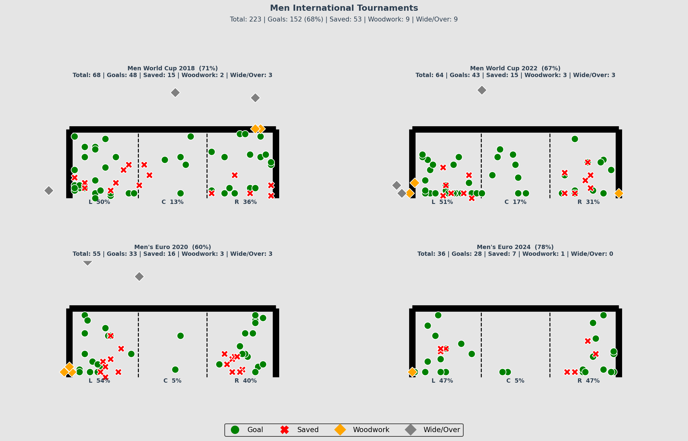

<em>Figure 1: All penalties taken in men's tournaments</em>

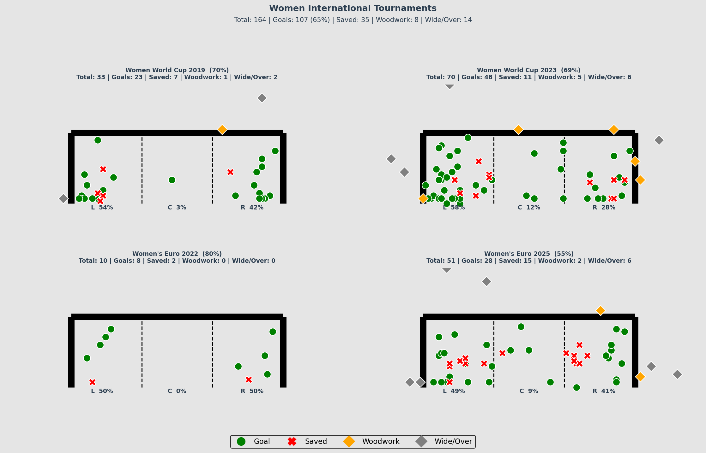

<em>Figure 2: All penalties taken in women's tournaments</em>

### **Comparing conversion rate for all penalties**

As per the two plots, men have a slightly higher conversion rate of 68% in comparison to women's 65%. 

A hypothesis test is now performed, with the following result is achieved:

**All Penalties - Goal Rate**\
[z-test]\
──────────────────────────────────────────────────\
  Men: 152/223  (68.2%)\
  Women: 107/164  (65.2%)\
  Pooled proportion : 0.6693\
  z-statistic       : 0.6028\
  p-value           : 0.5466\
  Cohen's h         : 0.0619\
  Significant (p<.05): No\
──────────────────────────────────────────────────

With a high z-statistic, we retain the null hypothesis that the conversion rates are equal. With a Cohen's h of less than 0.2, such differences can be classified as small.

### **Comparing off target rate for all penalties**

Despite less penalties being taken in women tournaments, more of them went off target than those of men. Therefore, another similar hypothesis test is performed, with off target rate being the subject of interest.

The following result is achieved:

**All Penalties — Off Target Rate (Woodwork + Wide/Over)**\
[z-test]\
──────────────────────────────────────────────────\
  Men: 18/223  (8.1%)\
  Women: 22/164  (13.4%)\
  Pooled proportion : 0.1034\
  z-statistic       : -1.7061\
  p-value           : 0.0880\
  Cohen's h         : -0.1738\
  Significant (p<.05): No\
──────────────────────────────────────────────────

Despite the z-statistic being very close to 0.05, we still retain the null hypothesis that the off target rates are equal. Cohen's h of less than 0.2, despite much closer this time, shows that the difference is small.

## **Comparing penalties taken in-game**

Now penalties taken during normal time will be looked further.

### **Comparing conversion rate for in-game penalties**

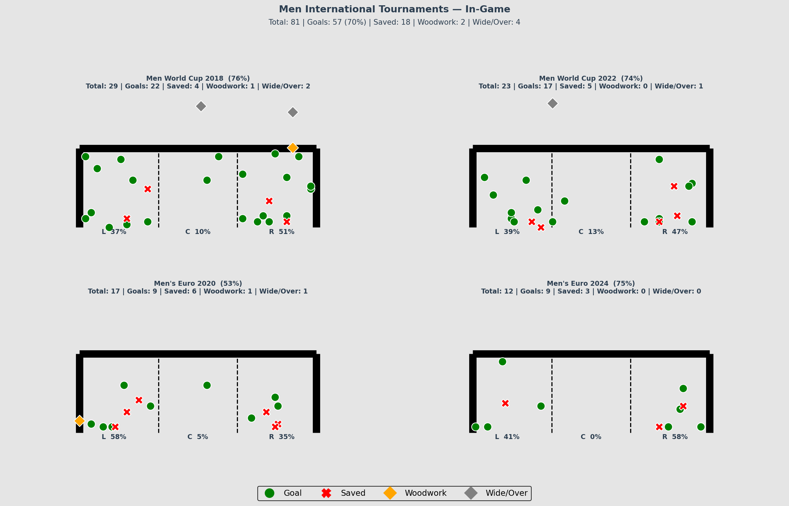

<em>Figure 3: All penalties taken in normal time in men's tournaments</em>

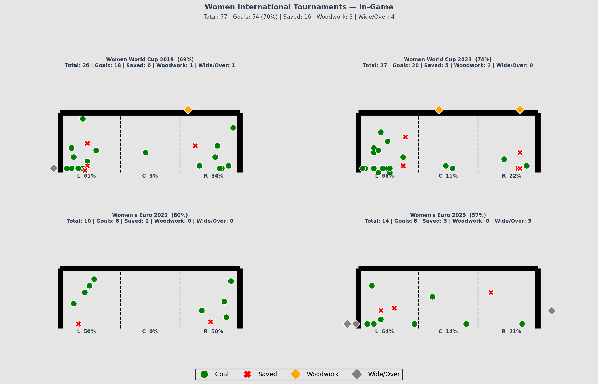

<em>Figure 4: Penalties taken in normal time in women's tournaments</em>

When it comes to in-game penalties, the conversion rate is quite similar of around 70%. Hypothesis testing also show very little difference in such conversion rate, as shown in this result:

**In-game Penalties - Goal Rate**\
[z-test]\
──────────────────────────────────────────────────\
  Men: 57/81 (70.4%)\
  Women: 54/77 (70.1%)\
  Pooled proportion : 0.7025\
  z-statistic       : 0.0331\
  p-value           : 0.9736\
  Cohen's h         : 0.0053\
  Significant (p<.05): No\
──────────────────────────────────────────────────

Since the z-statistic is very high and the Cohen's h is very low, statistically there is not much difference between men and women penalties in game.

### Comparing off target rate for in-game penalties

As for off target in-game penalties, although women players took 4 less penalties, they shot off target one more time. here is the result of the hypothesis test:

**In-game Penalties — Off Target Rate**\
[z-test]\
──────────────────────────────────────────────────\
  Men: 6/81 (7.4%)\
  Women: 7/77 (9.1%)\
  Pooled proportion : 0.0823\
  z-statistic       : -0.3849\
  p-value           : 0.7003\
  Cohen's h         : -0.0613\
  Significant (p<.05): No\
──────────────────────────────────────────────────

Such differences are too small statistically; therefore, there is not enough evidence to show that women shoot penalties off target at a higher rate than men.

### Comparing penalties by in-game time period

Next the time period when each penalty was taken is examined, as such differences in time period can affect players' mentality when they come up to the spot.

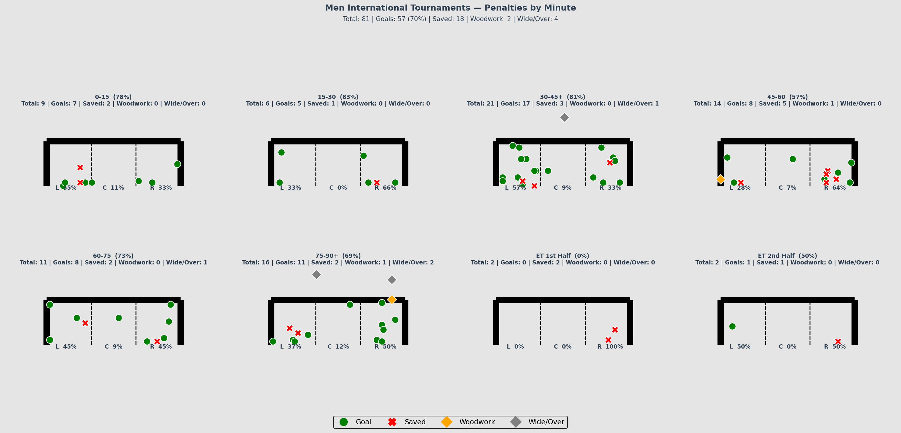

<em>Figure 5: All penalties taken in normal time in men's tournaments by time period</em>

When it comes to men's games, most penalties were taken during the last 15 minutes and additional time of the first half.

Conversion rates were very high in the first half, while there was a significant dip in conversion rate at the first 15 minutes of the second half, before stabilizing at around 70% in the last 30+ minutes in the second half.

Only 4 penalties were taken in extra time, in which only 1 was converted.

Here is the result of the hypothesis test comparing conversion rate between first half and second half in men's games:

**First Half vs Second Half — Conversion Rate — Men**\
[z-test]\
──────────────────────────────────────────────────\
  Men 1st Half: 29/36  (80.6%)\
  Men 2nd Half: 27/41  (65.9%)\
  Pooled proportion : 0.7273\
  z-statistic       : 1.4453\
  p-value           : 0.1484\
  Cohen's h         : 0.3348\
  Significant (p<.05): No\
──────────────────────────────────────────────────

With a p-value of 0.1484, we retain the hypothesis that the conversion rates were equal in the first and second half. However, Cohen's h of 0.3348 shows that the differences in conversion rates were of medium effect.

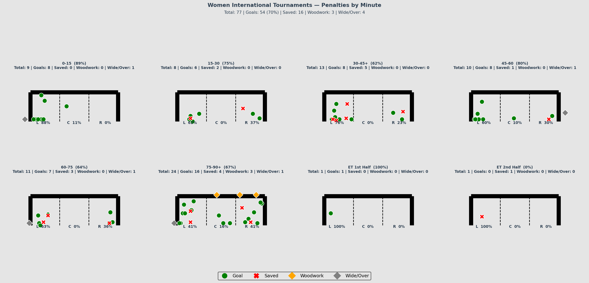

<em>Figure 6: Penalties taken in normal time in women's tournaments by time period</em>

Unlike in men's games, in women games, the last 15+ minutes of the second half saw most penalties being taken.

The first 15 minutes of each half were when conversion rates were very high for women, with 89% in the first half and 80% in the second half.

For other periods in regular time, the conversion rates per period were more stable.

Only 2 penalties were taken in extra time, with 1 goal and 1 saved.

The result of the hypothesis test comparing conversion rate between the first 15 minutes of both halves and the next 30+ minutes of both halves in women's games is as follows:

**First 15 Minutes vs Next 30+ Minutes Of Half — Conversion Rate — Women**\
[Fisher's Exact — small sample]\
──────────────────────────────────────────────────\
  Women First 15 Minutes: 16/19  (84.2%)\
  Women Next 30+ Minutes: 37/56  (66.1%)\
  Odds ratio        : 2.7387\
  p-value           : 0.1575\
  Significant (p<.05): No\
──────────────────────────────────────────────────

With a p-value of 0.1335, there is no evidence that the conversion rates were different between the periods considered. 

When it comes to the last 15+ minutes of the first half, men's conversion rate of 81% was much higher than women's of 62%, so a hypothesis test will be performed to see whether such difference is statistically significant.

**Last 15+ Minutes Of First Half — Conversion Rate — Men vs Women**\
[Fisher's Exact — small sample]\
──────────────────────────────────────────────────\
  Men 30-45+: 17/21  (81.0%)\
  Women 30-45+: 8/13  (61.5%)\
  Odds ratio        : 2.6562\
  p-value           : 0.2538\
  Significant (p<.05): No\
──────────────────────────────────────────────────\

This result retain the hypothesis that the conversion rate in this period was equal for both genders.

On the other hand, the reverse trend was observed in the first 15 minutes of the second half, where women converted 80% of the penalties, while men only converted 57%. Similar to the previous instance, we will use another hypothesis test to see if this subtle difference in conversion rate is statistically important.

**First 15 Minutes Of Second Half — Conversion Rate — Men vs Women**\
[Fisher's Exact — small sample]\
──────────────────────────────────────────────────\
  Men 45-60: 8/14  (57.1%)\
  Women 45-60: 8/10  (80.0%)\
  Odds ratio        : 0.3333\
  p-value           : 0.3875\
  Significant (p<.05): No\
──────────────────────────────────────────────────

Similar to the previous result, there is no evidence that the conversion rates for the two genders were different, despite the larger difference in conversion ratios.

### **Comparing penalties by in-game score differential**

Additionally, the score differential before each penalty was taken is examined, as such differentials can also contribute to players' mentality when taking penalties.

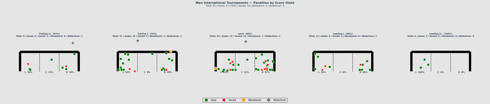

<em>Figure 7: All penalties taken in normal time in men's tournaments by score state</em>

For men's game, most penalties were taken when the score was level, followed by one goal deficit. More penalties were taken when teams were trailing than leading.

For most of the score differentials, the conversion rate stays around the actual in-game conversion rate of 70%, with trailing by one goal being slightly higher at 76%. All penalties are converted when teams were leading by two or more goals, although only 3 of 81 penalties are taken in this situation.

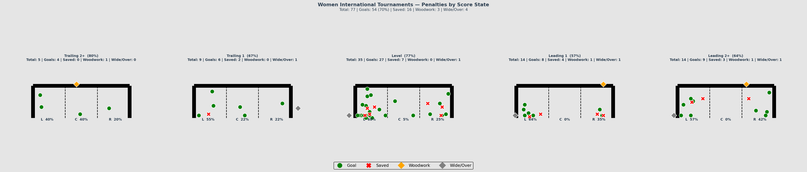

<em>Figure 8: Penalties taken in normal time in women's tournaments by score state</em>

Similar to men, in women's games, most penalties were taken when the teams were tied at that point. Unlike men, more penalties were taken when teams were leading than trailing, with 14 penalties taken when teams were already leading by more than one goal, in comparison to only 3 of men.

The conversion rate when teams were leading by one was significantly lower than in other scenarios of only 57%.

Hypothesis tests will be performed to see if conversion rates were different between men and women when the score was equal and when the team taking the penalty was leading by one.

**Score State Level - Conversion Rate - Men vs Women**\
[z-test]\
──────────────────────────────────────────────────\
  Men Level: 23/35  (65.7%)\
  Women Level: 27/35  (77.1%)\
  Pooled proportion : 0.7143\
  z-statistic       : -1.0583\
  p-value           : 0.2899\
  Cohen's h         : -0.2541\
  Significant (p<.05): No\
──────────────────────────────────────────────────

**Score State Leading 1 - Conversion Rate - Men vs Women**\
[Fisher's Exact — small sample]\
──────────────────────────────────────────────────\
  Men Leading 1: 9/13  (69.2%)\
  Women Leading 1: 8/14  (57.1%)\
  Odds ratio        : 1.6875\
  p-value           : 0.6946\
  Significant (p<.05): No\
──────────────────────────────────────────────────

Both tests show that there are no evidence to prove the hypotheses that the conversion rates for both genders in both scenarios were different.

### **Combining time period with score differential**

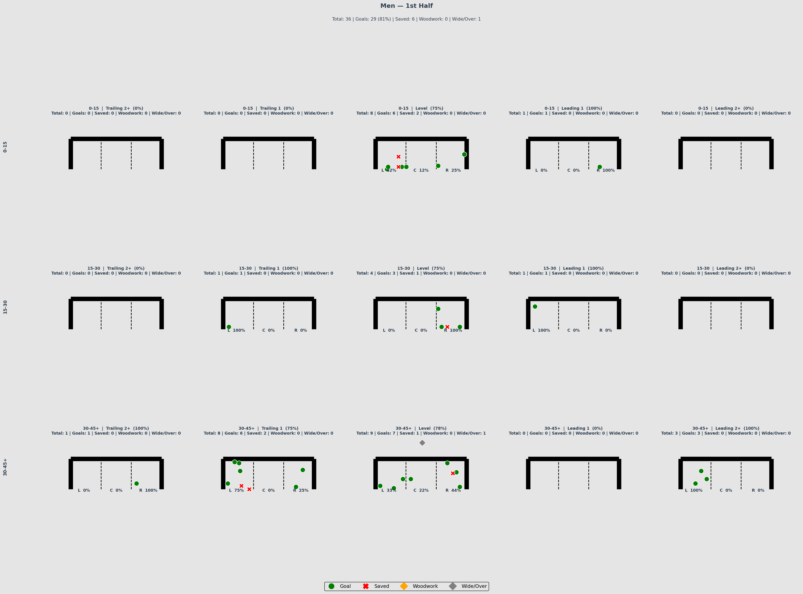

<em>Figure 9: All penalties taken in 1st half in men's tournaments by score state</em>

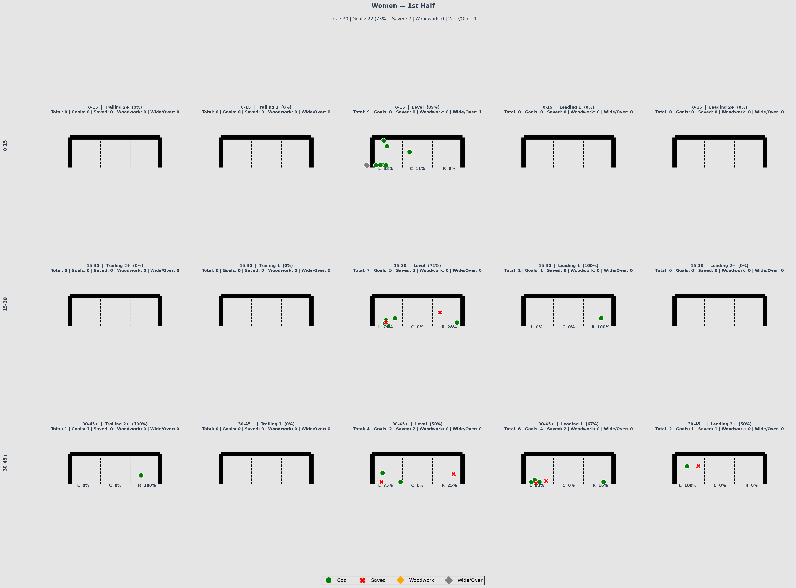

<em>Figure 10: All penalties taken in 1st half in women's tournaments by score state</em>

#### First 15 minutes of the game

For both genders, all but one penalty were taken when the score was level, and for the odd one out, it happened in a men's game when the team taking the penalty was leading by 1, and the penalty was successfully converted.

#### From 15th to 30th minute of 1st half

As for the next 15 minutes of the first half, similar trends can be observed, where most penalties were taken when when it was a tie at the time the penalty was taken, with 3 exceptions that were all converted, including 1 for men when the team was leading by 1, another 1 for men when the team was trailing by 1, and the last 1 for women when the team was leading by 1.

#### Last 15+ minutes of 1st half

The last 15+ minutes of the first half saw more score states algined with each penalty. These are the patterns that emerge within this period of time:

* 2 penalties were taken when the taking team was trailing by 2 or more goals, one for each gender. Both were succcessfully converted.
* Level score still accounted for a high proportion of the penalties for both genders, in which both genders' games saw 2 misses, but much more penalties were taken by men (7 against 4).
* No penalties were taken by men when their teams were leading by 1. On the other hand, no penalties were taken by women when their teams were trailing by 1.
* For penalties taken when men teams were trailing by 1, 6 out of 8 were converted, which returned a conversion rate of 75%, higher than the whole in-game average.
* For penalties taken when women teams were leading by 1, 4 out of 6 were converted, which returned a conversion rate of 67%, slightly lower than the whole in-game average.
* 3 penalties were taken when men teams were leading by 2 or more, which were all scored. 2 penalties were taken when women teams were leading by 2 or more, but only 1 was scored.

<em>Figure 11: All penalties taken in 2nd half in men's tournaments by score state</em>

<em>Figure 12: All penalties taken in 2nd half in women's tournaments by score state</em>

Initial observations show that no penalties were taken by men teams when they were leading by 2 or more goals. On the other hand, roughly a quarter of penalties taken in women's games were taken when the team was leading by 2 or more goals.

#### First 15 minutes of 2nd half

When it comes to the first 15 minutes of the second half, these happened:

* Similar to the last 15+ minutes of the first half, 2 penalties were taken when the taking team was trailing by 2 or more goals, one for each gender. The difference is that the men's penalty was saved, but the women's penalty was converted.
* All penalties taken when the team was trailing by 1 were converted, with 3 for men and 1 for women.
* Level score penalties were converted roughly 50% of the time for both genders.
* Both 2 penalties in women's games were converted when teams were leading by 1. In contrast, only 1 of 3 were converted in men's games when the deficit was similar.
* All 3 penalties taken by women when their teams were leading by 2 or more were converted.

#### From 60th to 75th minute of 2nd half

With a roughly similar number of penalties in the next 15 minutes as in the first 15 minutes of the second half, these are the patterns that emerged from the penalties taken during this period:

* All penalties taken when the team was trailing by 2 or more were converted, with 2 for men and 1 for women.
* For penalties taken when the team was trailing by 1, each gender saw 1 penalty missed. For those that went in, there were 1 for men and 2 for women.
* Similarly, only 1 miss per gender was observed when the score was level. Conversion rates for both genders were higher than when there was an 1-goal deficit, with 2 converted for men and 4 converted for women.
* Men players converted all 3 penalties when their teams were leading by 1. On the contrary, both 2 penalties were missed by women players in the same situation.
* Similar to men games, no penalties were observed in women games when teams were leading by 2 or more.

#### Last 15+ minutes of 2nd half

While for the last 15+ minutes of the second half, as more penalties were taken, more intriguing findings can be concluded:

* When teams were trailing by 2, the conversion rate was just over 50% for both genders, with that of 50% for women and 60% for men.
* A higher conversion rate was seen when teams were trailing by 1 than when teams were trailing by 2 or more, with 67% conversion rate for men and 75% conversion rate for women.
* All penalties were converted when teams were equal on goals, with 1 for men and 6 for women.
* Only 1 penalty was missed by men when their teams were leading by 1, while the other 3 were converted. Conversely, only 1 penalty was converted by women when their teams were leading by 1, while the other 2 did not convert into a goal.
* As for penalties taken when teams were leading by 2 or more, while none were taken by men, this score state saw the most penalties among the five states considered in women's games. However, conversion rate was rather low, as only 5 out of 9 were converted.

#### Extra time

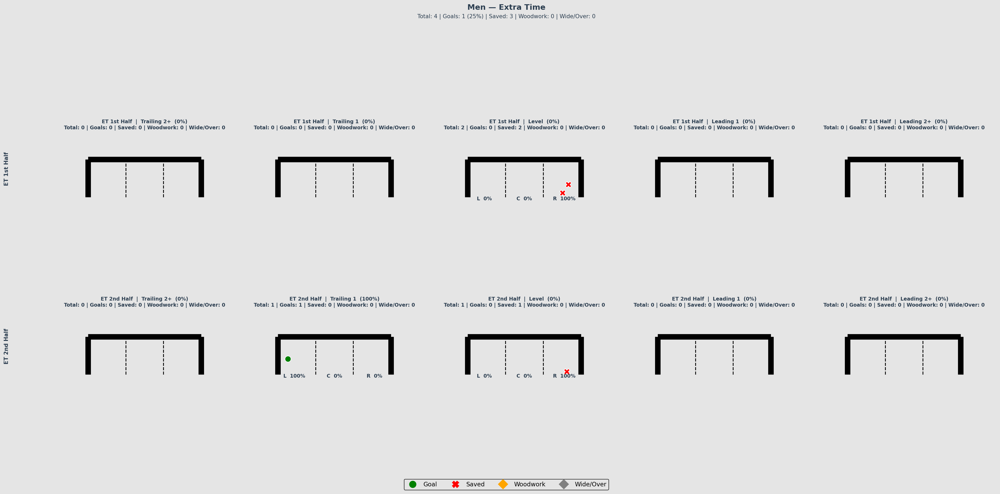

<em>Figure 13: All penalties taken in Extra Time in men's tournaments by score state</em>

Among the 4 penalties taken during extra time, the only one converted was when the team was trailing.

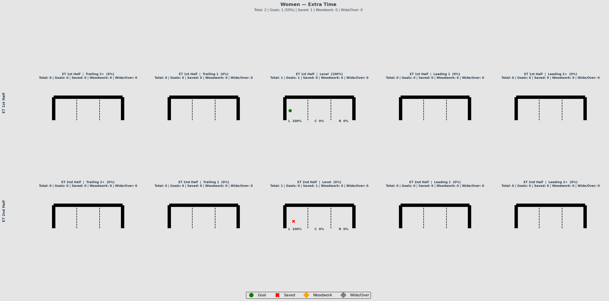

<em>Figure 14: All penalties taken in Extra Time in women's tournaments by score state</em>

Both penalties were taken when the score was level, in which the one converted was in the first half of extra time, while the saved one took place in the second half of extra time.

## **Comparing penalties taken during shootouts**

In this section, the focus will move to penalties taken during shootouts.

### **Comparing conversion rate for shootout penalties**

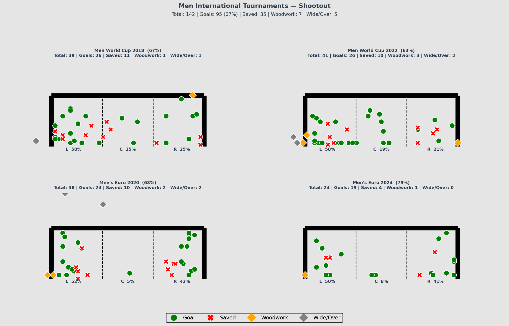

<em>Figure 15: All penalties taken in shooutouts in men's tournaments</em>

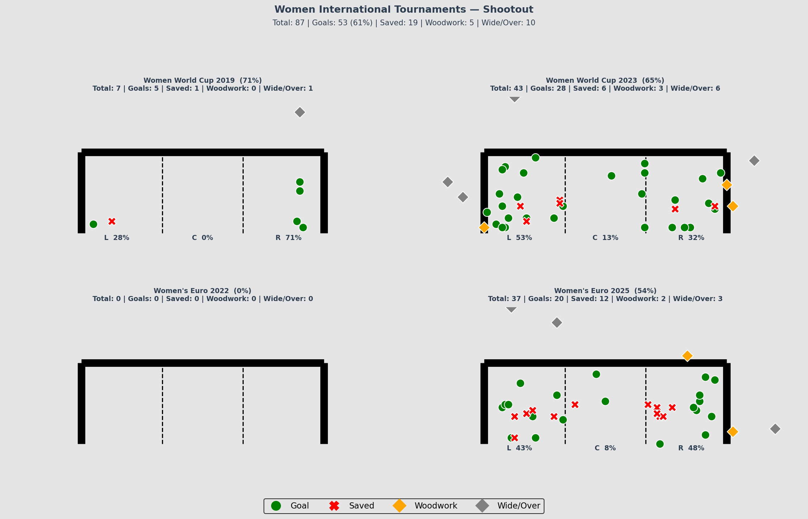

<em>Figure 16: Penalties taken in shooutouts in women's tournaments</em>

67% for men and 61% for women in shootouts create a larger conversion rate difference of 6% than that for all penalties (3%) and in game penalties (0%). Hypothesis testing returns the following results:

**Shootout Penalties Only - Goal Rate**\
[z-test]\
──────────────────────────────────────────────────\
  Men: 95/142  (66.9%)\
  Women: 53/87  (60.9%)\
  Pooled proportion : 0.6463\
  z-statistic       : 0.9189\
  p-value           : 0.3581\
  Cohen's h         : 0.1247\
  Significant (p<.05): No\
──────────────────────────────────────────────────\

Despite the difference in conversion rates, the hypothesis test shows that there is no statistical evidence that the two genders convert penalties at different rates.

However, when it comes to off target shootout penalties, while women shot off target only 3 more times at 15 against men's 12 times, the number of penalties taken by women were approximately half of that taken by men (87 against 142). Here are the results from the hypothesis test for off target rates in shootouts:

**Shootout Penalties Only — Off Target Rate**\
[z-test]\
──────────────────────────────────────────────────\
  Men: 12/142  (8.5%)\
  Women: 15/87  (17.2%)\
  Pooled proportion : 0.1179\
  z-statistic       : -2.0021\
  p-value           : 0.0453\
  Cohen's h         : -0.2665\
  Significant (p<.05): Yes\
──────────────────────────────────────────────────

The p-value of less than 0.05 means that the null hypothesis is rejected. In other words, there is statistical evidence that women take shootout penalties off target at a higher rate than men. A Cohen's h of higher than 0.2 shows that the difference is more than subtle.

### **Comparing shooutout results by kick slot**

Another important aspect of shooutouts is whether teams take their penalties first or second.

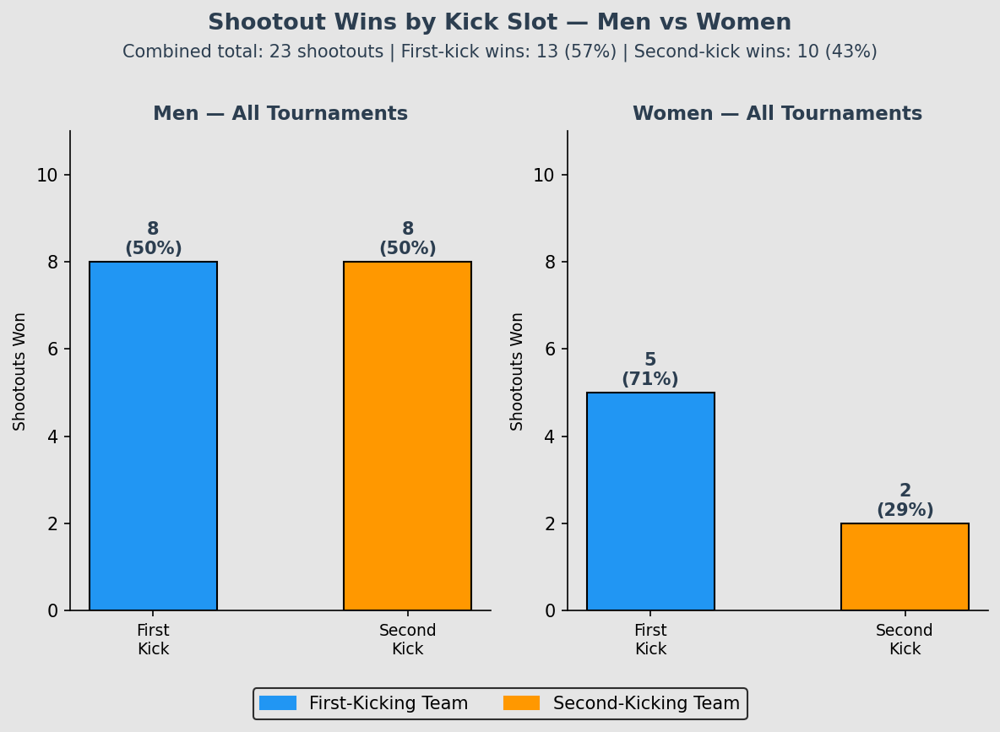

<em>Figure 17: Shooutout wins by kick slot</em>

While the win rate for first versus second slots was the same for men, clear difference exists in women tournaments, where first kick teams won much more than second kick teams (5 against 2).

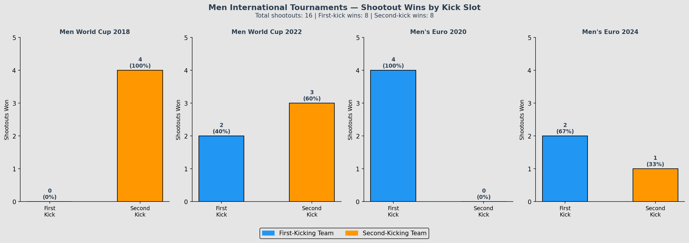

<em>Figure 18: Shooutout wins by kick slot in men's tournaments</em>

For men's tournaments, while the two World Cups saw more second kick teams won shooutouts, the reverse trend was observed in European Championships. In particular, all shootouts in World Cup 2018 were won by second kick teams, while Euro 2020 saw all first kick teams won shootouts.

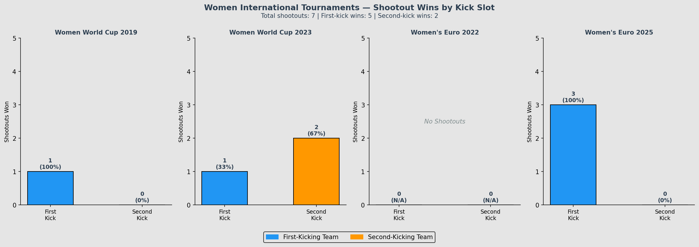

<em>Figure 19: Shooutout wins by kick slot in women's tournaments</em>

For the 2 times that second kick teams won shootouts in women's games, they both happen in World Cup 2023, where only 1 shootout in that tournament was won by the first kick team. The only shootout in World Cup 2019 was won by the first kick team, while all 3 shootouts in Euro 2025 were all won by the 3 first kick teams. Euro 2022 was the only tournament that did not see any shootouts.

### **Comparing shootout penalties by kick order**

Now conversion rates by  kick order (first penalty, second penalty, third penalty, etc.) will be looked further.

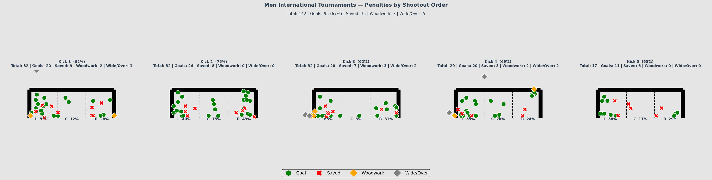

<em>Figure 20: Men's shootout penalties by kick order</em>

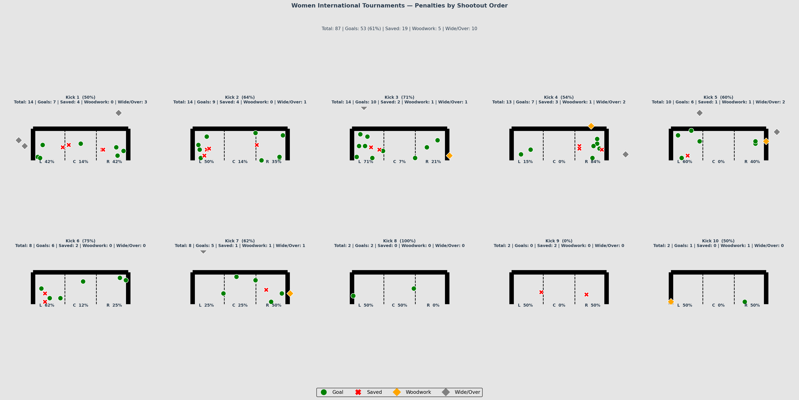

<em>Figure 21: Women's shootout penalties by kick order</em>

All men's shootouts finished within the first five kicks, while 4 out the women's shootouts ended after 7 kicks, and 1 finished after 10 kicks, which eventually is the record for the most penalties taken during shootouts in all FIFA tournaments.

For men's games, the second kick saw the highest conversion rate, while the first and third kicks saw the equal lowest conversion rate.

While for women's games, the third kick saw the highest conversion rate, while the first kick saw the lowest conversion rate. One more penalty was converted in the 6th kick than in the 7th kick (6 against 5). Both 8th kick penalties were converted, while neither 9th kick ones were scored. One 10th kick was converted, while the other one was missed.

With regards to the first five kicks, with the exception of the third kick, all the other 4 kicks saw men converted at higher rates than women. The conversion rate gap was the most considerable at 15%.

Hypothesis tests return these results when comparing conversion rates by kick order for the first 5 kicks for men versus women:

**Kick Order 1 - Conversion Rate - Men vs Women**\
[Fisher's Exact — small sample]\
──────────────────────────────────────────────────\
  Men Kick 1: 20/32  (62.5%)\
  Women Kick 1: 7/14  (50.0%)\
  Odds ratio        : 1.6667\
  p-value           : 0.5217\
  Significant (p<.05): No\
──────────────────────────────────────────────────

**Kick Order 2 - Conversion Rate - Men vs Women**\
[Fisher's Exact — small sample]\
──────────────────────────────────────────────────\
  Men Kick 2: 24/32  (75.0%)\
  Women Kick 2: 9/14  (64.3%)\
  Odds ratio        : 1.6667\
  p-value           : 0.4934\
  Significant (p<.05): No\
──────────────────────────────────────────────────

**Kick Order 3 - Conversion Rate - Men vs Women**\
[Fisher's Exact — small sample]\
──────────────────────────────────────────────────\
  Men Kick 3: 20/32  (62.5%)\
  Women Kick 3: 10/14  (71.4%)\
  Odds ratio        : 0.6667\
  p-value           : 0.7395\
  Significant (p<.05): No\
──────────────────────────────────────────────────

**Kick Order 4 - Conversion Rate - Men vs Women**\
[Fisher's Exact — small sample]\
──────────────────────────────────────────────────\
  Men Kick 4: 20/29  (69.0%)\
  Women Kick 4: 7/13  (53.8%)\
  Odds ratio        : 1.9048\
  p-value           : 0.4880\
  Significant (p<.05): No\
──────────────────────────────────────────────────

**Kick Order 5 - Conversion Rate - Men vs Women**\
[Fisher's Exact — small sample]\
──────────────────────────────────────────────────\
  Men Kick 5: 11/17  (64.7%)\
  Women Kick 5: 6/10  (60.0%)\
  Odds ratio        : 1.2222\
  p-value           : 1.0000\
  Significant (p<.05): No\
──────────────────────────────────────────────────

All hypothesis tests for all kick orders retained the null hypothesis that the conversion rates are not different between men and women.

### **Comparing shootout penalties by kick slot and kick order**

Now conversion rates will be examined with respect to both kick slot and kick order.

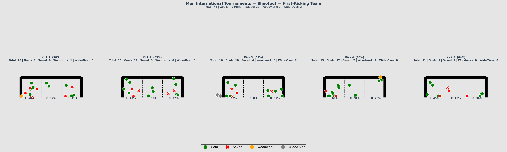

<em>Figure 22: Men's shootout penalties by kick order</em>

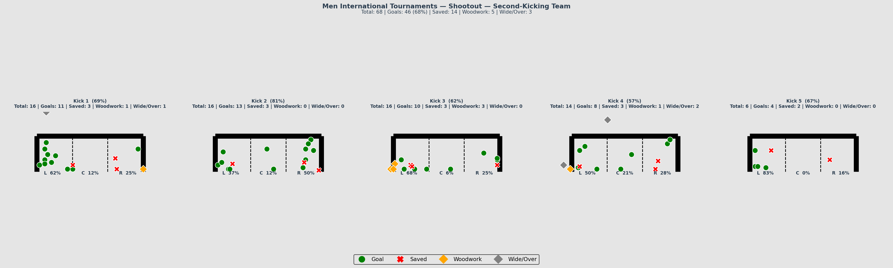

<em>Figure 23: Men's shootout penalties by kick order</em>

In men's games:

* First-kick teams converted worse for the first 2 kicks
* Conversion rates were the same for both teams for the 3rd kick
* First-kick teams converted better for the 4th kick
* Second-kick teams converted slightly better for the 5th kick

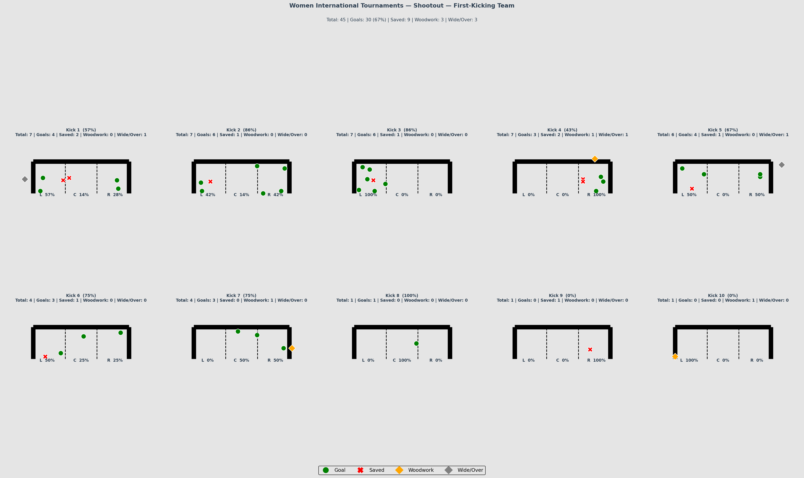

<em>Figure 24: Women's shootout penalties by kick order</em>

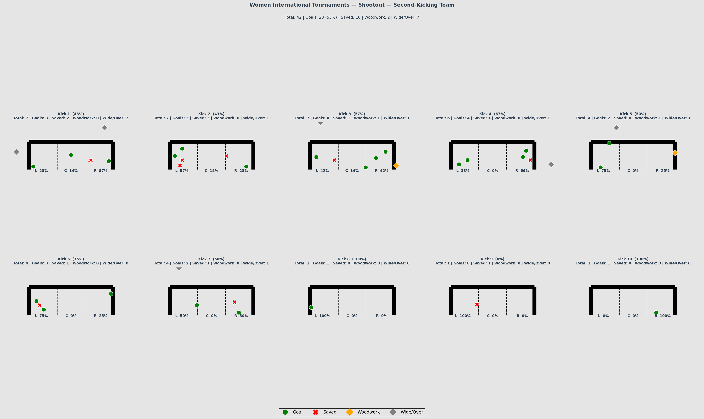

<em>Figure 25: Women's shootout penalties by kick order</em>

In women's games:

* The 1st, 2nd, 3rd, and 5th kicks saw first-kick teams convert better, in particular the 2nd and 3rd kicks where the differences were substantial
* The 4th kick was better converted by second-kick teams
* Conversion rates were the same for the 6th kick for both teams at 75% (3 out of 4)
* First-kick teams converted 1 more penalty than second-kick teams when it comes to the 7th kick

For first-kick teams:

* Conversion rates were quite similar for the 1st kick
* Women converted the 2nd and 3rd kick better than men
* Men converted the 4th kick much better than women
* Men converted the 5th kick slightly better than women

For second-kick teams:

* Men converted much better than women for the 1st and 2nd kicks
* The 3rd kick saw men converted a bit better than women
* The 4th kick saw women converted better than men
* The 5th kick saw men converted better than women

### **Comparing shootout penalties by kick slot and kick order and score differential**

One last factor that will be put into consideration is score differential. This factor will be examined consequentially from the first kick, to the second kick, then third kick, then so on. For each kick, the outcome of the first kicking teams will be evaluated first, unless it is either the first kick or a sudden death kick where first kicking teams always take their penalties when the score is level.

#### Second Kicking Teams By First Penalies

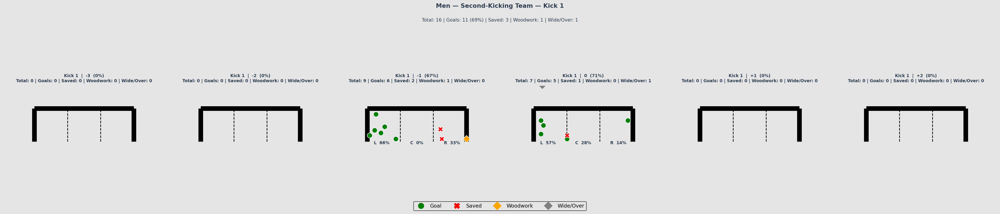

<em>Figure 26: Second kicking men's shootout first penalties</em>

Conversion rates for second kicking teams in first penalties were rather similar either when the first kicking teams converted or missed their penalties, although the rate was slightly higher when first kicking teams missed their penalties.

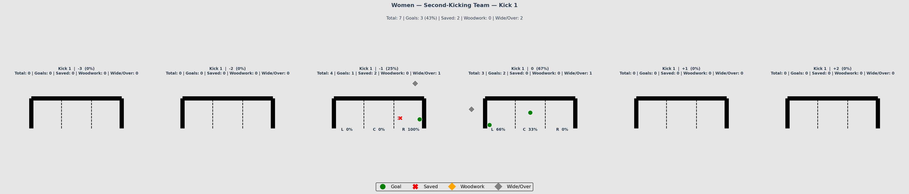

<em>Figure 27: Second kicking women's shootout first penalties</em>

Unlike men, second kicking teams' women players converted their first penalties much better when first kicking teams missed their penalties than converted.

Men's conversion rate was better for second kicking teams taking their first penalties.

#### First Kicking Teams By Second Penalties

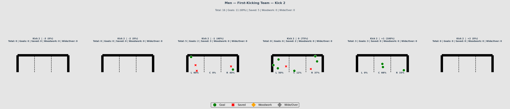

<em>Figure 28: First kicking men's shootout second penalties</em>

The higher the score differential, the better the conversion rates for first kicking me teams in the second kick. The trend starts with a quite low conversion rate when trailing, to a more decent conversion rate when level, and then all converted when teams were leading.

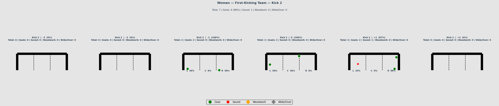

<em>Figure 29: First kicking women's shootout second penalties</em>

The only penalty missed among the ones taken by first kicking women teams in the second kick happened when they were leading.

Women's conversion rate was better for first kicking teams taking their second penalties.

#### Second Kicking Teams By Second Penalties

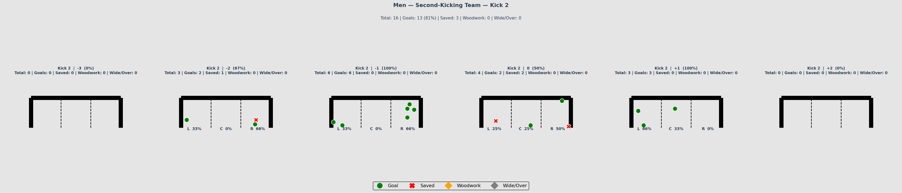

<em>Figure 30: Second kicking men's shootout second penalties</em>

Overall conversion rate was quite high. 3 of 16 were missed, in which 1 happened when teams were trailing by 2, while the other 2 happened when teams were level.

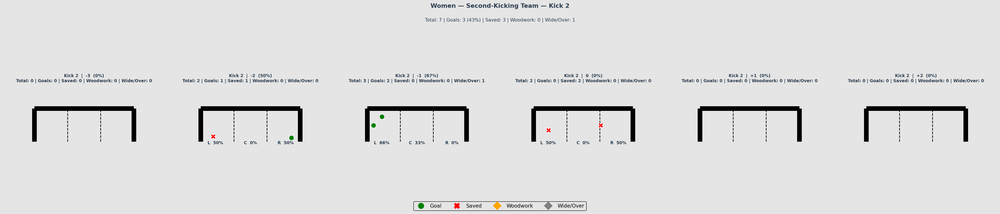

<em>Figure 31: Second kicking women's shootout second penalties</em>

None of the penalties happened when happened when they were leading by 1. Both penalties when teams were level were missed, while 1 was missed when the deficit was 1, and another 1 was missed when the deficit was 2.

Men's conversion rate was much better for second kicking teams taking their second penalties, in which the rate almost doubled.

#### First Kicking Teams By Third Penalties

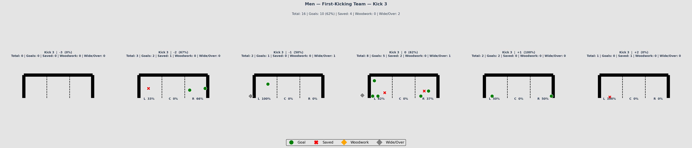

<em>Figure 32: First kicking men's shootout third penalties</em>

The only penalty taken when the team was leading by 2 was missed, while both penalties taken when teams were leading by 1 were converted.
Average conversion rates occured when teams were either level or trailing by 2, while conversion rate was lower when the deficit was 1.

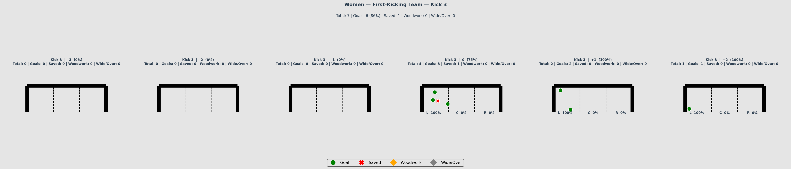

<em>Figure 33: First kicking women's shootout third penalties</em>

All 3 penalties taken when teams were leading were converted, while only 1 of 4 was missed when teams were equal on the scoreline. No penalties were taken when teams were trailing.

Women's conversion rate was better for first kicking teams taking their third penalties.

#### Second Kicking Teams By Third Penalties

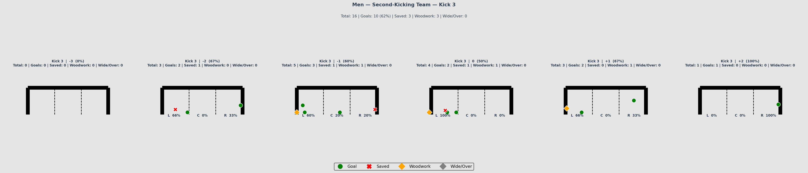

<em>Figure 34: Second kicking men's shootout second penalties</em>

The only penalty taken when the team was leading by 2 was converted, marking the end of that game.
Conversion rates were similar of 2 out of 3 when teams were leading by 1 and trailing by 2.
2 penalties were missed when teams were level, while another 2 were missed when teams were trailing by 1.

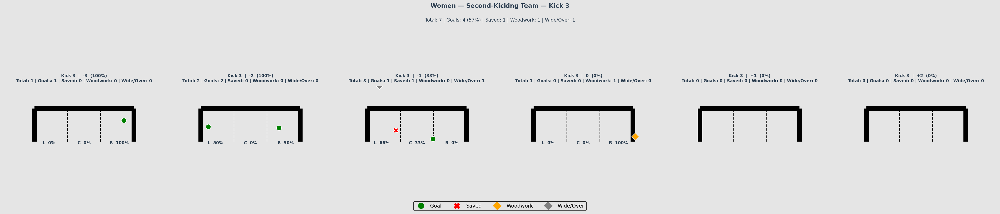

<em>Figure 35: Second kicking women's shootout second penalties</em>

None of the penalties happened when happened when teams were leading.
The only penalty taken when the scoreline was level was missed.
Only 1 out of 3 penalties was converted when teams were trailing by 1.
All penalties were converted when teams were trailing by 2 or more.

Men's conversion rate was just slightly better for second kicking teams taking their third penalties by 5%, in which both conversion rates were rather below average.

#### First Kicking Teams By Fourth Penalties

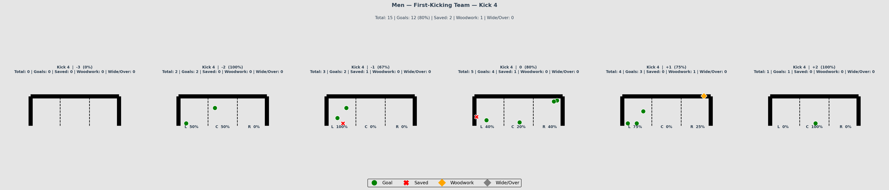

<em>Figure 36: First kicking men's shootout fourth penalties</em>

The only penalty taken when the team was leading by 2 was converted, which made them winner of that game.
Only 1 was missed when teams were leading by 1, another 1 was missed when the score was level, while the remaining miss happened when the team was trailing by 1.
Both penalties taken when teams were trailing by 2 were converted.

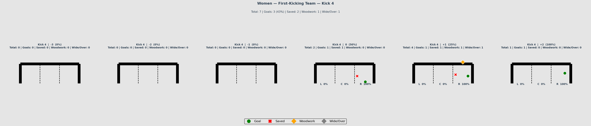

<em>Figure 37: First kicking women's shootout fourth penalties</em>

No penalties were taken when teams were trailing.
Similar to men, the only penalty taken when the team was leading by 2 was converted, which became the winning penalty.
Only 1 was converted when teams were leading by 1, and another 1 when teams were level.

Men's conversion rate was much better for first kicking teams taking their fourth penalties, in which the rate almost doubled. This trend was similar to when second kicking teams took their second penalties.

#### Second Kicking Teams By Fourth Penalties

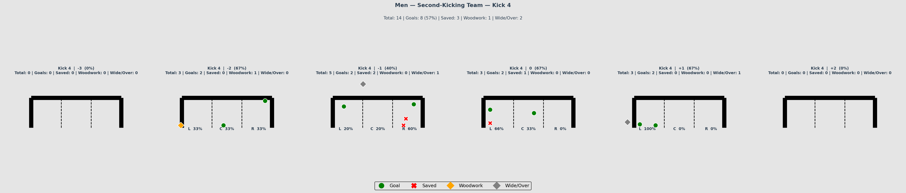

<em>Figure 38: Second kicking men's shootout fourth penalties</em>

For each of the scenarios where the difference was -2, -1, or +1, 2 penalties were converted and 1 was missed.
When the deficit was 1, only 2 were converted out of 5.

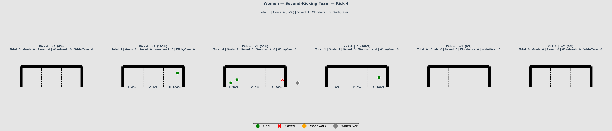

<em>Figure 39: Second kicking women's shootout fourth penalties</em>

None of the penalties happened when happened when teams were leading.
Both misses happened when teams were trailing by 1.

Women converted at a higher rate then men for second taking teams on their fourth penalties.

#### First Kicking Teams By Fifth Penalties

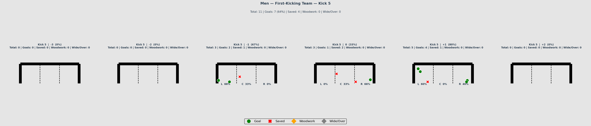

<em>Figure 40: First kicking men's shootout fifth penalties</em>

All but one dagger penalties were converted.
Only 1 out of 3 penalties was converted when teams were level, while only 1 out of 3 penalties was missed when teams needed to score to keep the game alive.

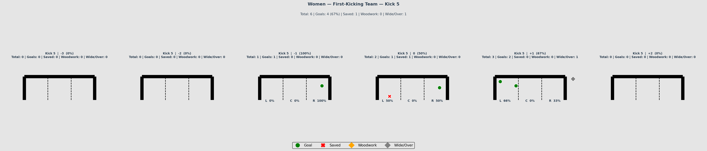

<em>Figure 41: First kicking women's shootout fifth penalties</em>

Similar to men, only 1 dagger penalty was missed.
One was successfully taken when the scoreline was level, while the other one in the same situation was missed.
The only penalty taken when the team was trailing was converted.

Conversion rates for both genders were around average, with that of women slightly better than men.

#### Second Kicking Teams By Fifth Penalties

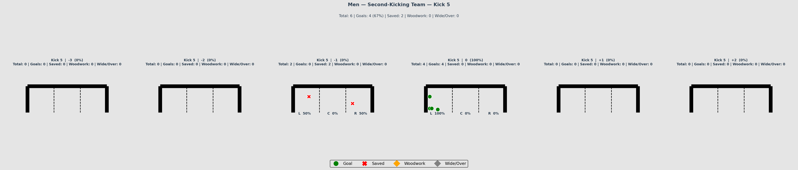

<em>Figure 42: Second kicking men's shootout fifth penalties</em>

All penalties when teams were trailing were missed, while all penalties when teams were level were converted. All of them led to games being decided.

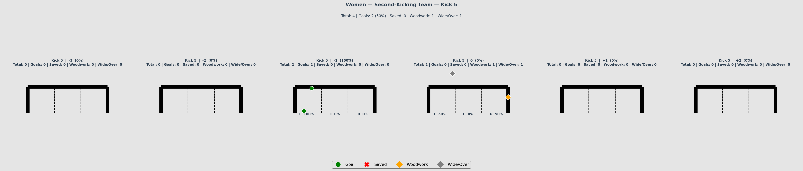

<em>Figure 43: Second kicking women's shootout fifth penalties</em>

The reverse trend was observed in the women's games.
All penalties when teams were level were missed, while all penalties when teams were trailing were converted. All of them led to shootouts going to sudden death.

#### Second Kicking Women Teams By Sixth Penalties

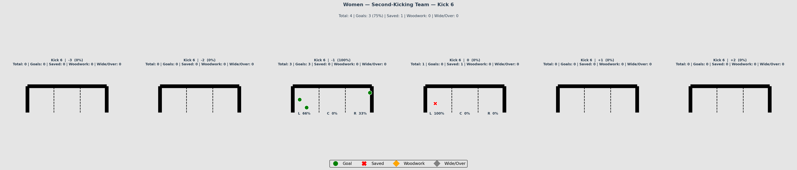

<em>Figure 44: Second kicking women's shootout sixth penalties</em>

All outcomes of the penalties did not end the shootouts.

#### Second Kicking Women Teams By Seventh Penalties

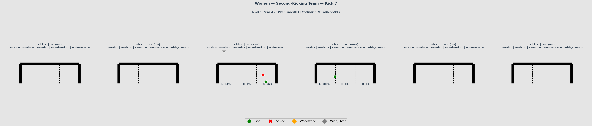

<em>Figure 45: Second kicking women's shootout seventh penalties</em>

Unlike the 6th penalty, all penalties led to the game being ended, except 1 when the team scored the penalty when the first kicking team had already converted.

## **Comparing in-game penalties against shootout penalties**

### **Comparing in-game penalties against shootout penalties for all genders**

**All Genders — Conversion Rate — In-Game vs Shootout**\
[z-test]\
──────────────────────────────────────────────────\
  All In-Game: 111/158  (70.3%)\
  All Shootout: 148/229  (64.6%)\
  Pooled proportion : 0.6693\
  z-statistic       : 1.1559\
  p-value           : 0.2477\
  Cohen's h         : 0.1201\
  Significant (p<.05): No\
──────────────────────────────────────────────────

While in-game penalties were converted at a higher rate than shootout ones with the difference of 6%, hypothesis testing shows that such difference is not statistically important.

### **Comparing in-game penalties against shootout penalties for men**

**Men — Conversion Rate — In-Game vs Shootout**\
[z-test]\
──────────────────────────────────────────────────\
  Men In-Game: 57/81  (70.4%)\
  Men Shootout: 95/142  (66.9%)\
  Pooled proportion : 0.6816\
  z-statistic       : 0.5348\
  p-value           : 0.5928\
  Cohen's h         : 0.0748\
  Significant (p<.05): No\
──────────────────────────────────────────────────

With men's shootout conversion rate higher than all genders' shootout conversion rate, the difference in in-game versus shootout penalties for men became much smaller to only 3.5%, which is also not significant due to the lack of statistical evidence.

### **Comparing in-game penalties against shootout penalties for women**

**Women — Conversion Rate — In-Game vs Shootout**\
[z-test]\
──────────────────────────────────────────────────\
  Women In-Game: 54/77  (70.1%)\
  Women Shootout: 53/87  (60.9%)\
  Pooled proportion : 0.6524\
  z-statistic       : 1.2362\
  p-value           : 0.2164\
  Cohen's h         : 0.1942\
  Significant (p<.05): No\
──────────────────────────────────────────────────

Unlike men, women's shootout conversion rate was lower than that for all genders. Therefore, the gap was widened to 9.5%, but hypothesis test indicates no evidence that such difference is statistically considerable.

## **Comparing penalties by foot taken**

The next aspect examined in this study is conversion rates by foot.

### **Comparing left-footed penalties**

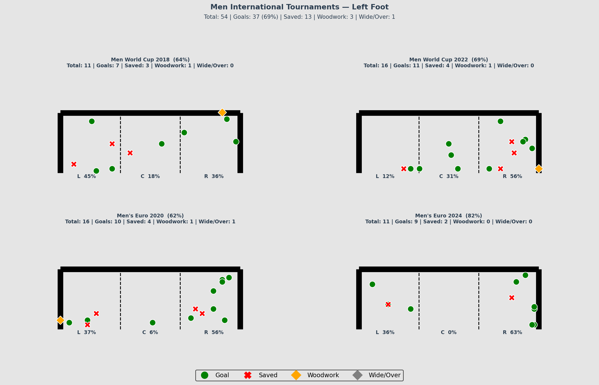

<em>Figure 46: All left-footed penalties taken in men's tournaments</em>

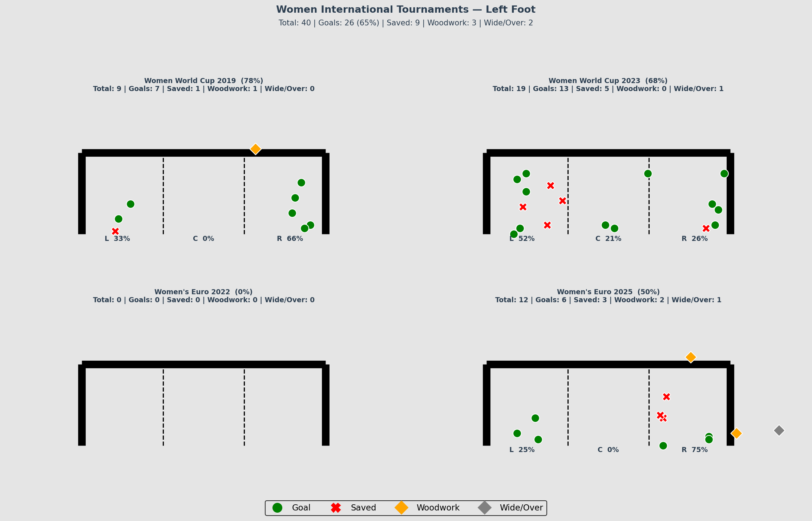

<em>Figure 47: All left-footed penalties taken in women's tournaments</em>

#### Comparing left-footed penalties by conversion rate

Conversion rate was slightly higher for men than women. These are the results returned by hypothesis testing:

**Left-footed — Conversion Rate — Men vs Women**\
[z-test]\
──────────────────────────────────────────────────\
  Men (Left): 37/54  (68.5%)\
  Women (Left): 26/40  (65.0%)\
  Pooled proportion : 0.6702\
  z-statistic       : 0.3588\
  p-value           : 0.7198\
  Cohen's h         : 0.0747\
  Significant (p<.05): No\
──────────────────────────────────────────────────

There is no statistical evidence that men left-footers and women left-footers took penalties at different conversion rates.

#### Comparing left-footed penalties by left or right end location - All genders

**Left Foot — All Genders — Shot Left vs Shot Right**\
[z-test]\
──────────────────────────────────────────────────\
  All Genders Left Foot → Left: 20/33  (60.6%)\
  All Genders Left Foot → Right: 33/49  (67.3%)\
  Pooled proportion : 0.6463\
  z-statistic       : -0.6261\
  p-value           : 0.5313\
  Cohen's h         : -0.1406\
  Significant (p<.05): No\
──────────────────────────────────────────────────

Left-footers chose to shot right more than left, and the conversion rate to the right was also higher by approximately 7%. However, hypothesis test indicates that this difference in conversion rate is not statistically significant.

#### Comparing left-footed penalties by left or right end location - Men

**Left Foot — Men — Shot Left vs Shot Right**\
[Fisher's Exact — small sample]\
──────────────────────────────────────────────────\
  Men Left Foot → Left: 9/17  (52.9%)\
  Men Left Foot → Right: 21/29  (72.4%)\
  Odds ratio        : 0.4286\
  p-value           : 0.2130\
  Significant (p<.05): No\
──────────────────────────────────────────────────

Men left-footers converted their penalties to the right at a much higher rate than to the left, with the difference in conversion rates of almost 20%. However, as the p-value is still greater than 0.05, there is no evidence that such rates are different.

#### Comparing left-footed penalties by left or right end location - Women

**Left Foot — Women — Shot Left vs Shot Right**\
[Fisher's Exact — small sample]\
──────────────────────────────────────────────────\
  Women Left Foot → Left: 11/16  (68.8%)\
  Women Left Foot → Right: 12/20  (60.0%)\
  Odds ratio        : 1.4667\
  p-value           : 0.7314\
  Significant (p<.05): No\
──────────────────────────────────────────────────

While women left-footers shot to right slightly more times than men, conversion rate to the left was actually higher than to the right of 8%. Similar to previous instances, the null hypothesis that the conversion rates are equal is retained.  

### **Comparing right-footed penalties**

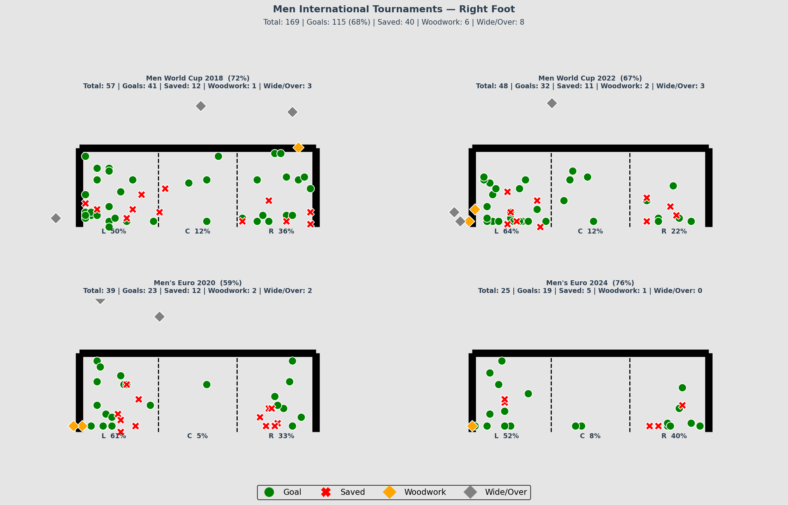

<em>Figure 48: All right-footed penalties taken in men's tournaments</em>

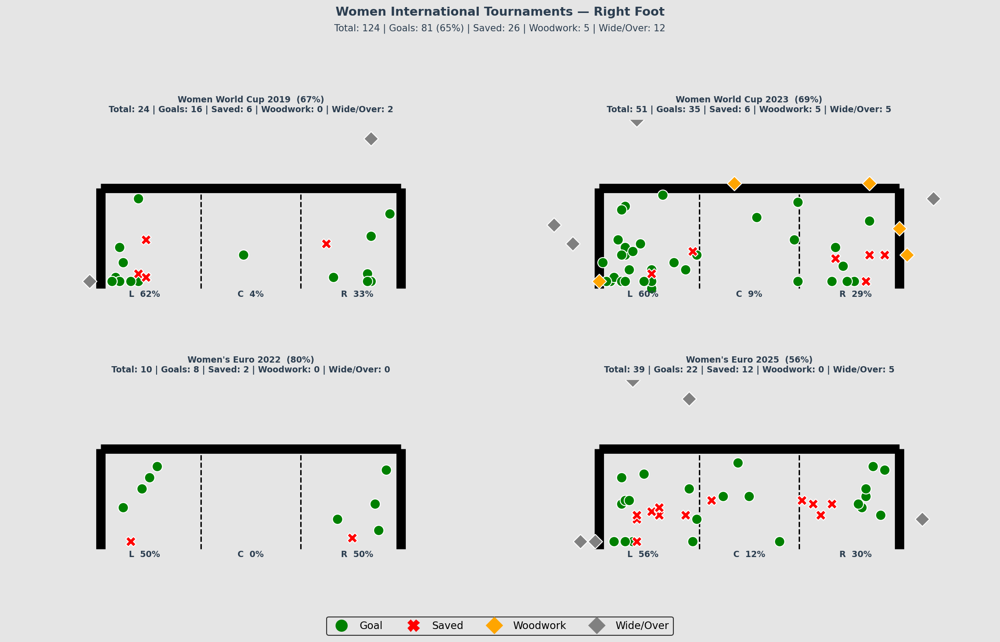

<em>Figure 49: All right-footed penalties taken in women's tournaments</em>

#### Comparing right-footed penalties by conversion rate

Similar to left-footed penalties, right-footed penalties were converted at a slightly higher rate for men than women. The results of the hypothesis test are as follows:

**Right-footed — Conversion Rate — Men vs Women**\
[z-test]\
──────────────────────────────────────────────────\
  Men (Right): 115/169  (68.0%)\
  Women (Right): 81/124  (65.3%)\
  Pooled proportion : 0.6689\
  z-statistic       : 0.4897\
  p-value           : 0.6244\
  Cohen's h         : 0.0578\
  Significant (p<.05): No\
──────────────────────────────────────────────────

As the null hypothesis is retained, the difference in conversion rates between right-footers men and women is not statistically significant.

#### Comparing right-footed penalties by left or right end location - All genders

**Right Foot — All Genders — Shot Left vs Shot Right**\
[z-test]\
──────────────────────────────────────────────────\
  All Genders Right Foot → Left: 117/170  (68.8%)\
  All Genders Right Foot → Right: 58/95  (61.1%)\
  Pooled proportion : 0.6604\
  z-statistic       : 1.2810\
  p-value           : 0.2002\
  Cohen's h         : 0.1631\
  Significant (p<.05): No\
──────────────────────────────────────────────────

Right-footers chose to shot left at almost double the times they shot right, and conversion rate to the left was almost 8% higher. Nevertheless, such difference is not statistically substantial, as shown in a p-value larger than 0.05.

#### Comparing right-footed penalties by left or right end location - Men

**Right Foot — Men — Shot Left vs Shot Right**\
[z-test]\
──────────────────────────────────────────────────\
  Men Right Foot → Left: 68/97  (70.1%)\
  Men Right Foot → Right: 35/55  (63.6%)\
  Pooled proportion : 0.6776\
  z-statistic       : 0.8197\
  p-value           : 0.4124\
  Cohen's h         : 0.1375\
  Significant (p<.05): No\
──────────────────────────────────────────────────

Men right-footers shot left almost double the times they shot right, with the conversion rate difference of 7%, in which hypothesis test shows that there is no evidence that the difference is statistically major.

#### Comparing right-footed penalties by left or right end location - Women

**Right Foot — Women — Shot Left vs Shot Right**\
[z-test]\
──────────────────────────────────────────────────\
  Women Right Foot → Left: 49/73  (67.1%)\
  Women Right Foot → Right: 23/40  (57.5%)\
  Pooled proportion : 0.6372\
  z-statistic       : 1.0174\
  p-value           : 0.3090\
  Cohen's h         : 0.1990\
  Significant (p<.05): No\
──────────────────────────────────────────────────

A similar trend in men right-footers is also observed in women right-footers when it comes to number of times each side was chosen and conversion rate. Despite the difference being slightly larger of 10%, hypothesis test retains the null hypothesis that the conversion rates are not different for each side.

### **Comparing left-footed and right-footed penalties**

Further hypothesis tests will be carried out to compare left-footed penalties against right-footed penalties, for both genders, and also within each gender.

#### Comparing left against right-footed penalties for all genders

**Left vs Right Foot - Conversion Rate — All genders combined**\
[z-test]\
──────────────────────────────────────────────────\
  Left Foot: 63/94  (67.0%)\
  Right Foot: 196/293  (66.9%)\
  Pooled proportion : 0.6693\
  z-statistic       : 0.0228\
  p-value           : 0.9818\
  Cohen's h         : 0.0027\
  Significant (p<.05): No\
──────────────────────────────────────────────────

With the conversion rate of approximately 67% for each foot, hypothesis testing also shows that left-footers and right-footers did not take penalties at different conversion rates.

**Left vs Right Foot — Off Target Rate — All genders combined**\
[z-test]\
──────────────────────────────────────────────────\
  Left Foot: 9/94  (9.6%)\
  Right Foot: 31/293  (10.6%)\
  Pooled proportion : 0.1034\
  z-statistic       : -0.2787\
  p-value           : 0.7805\
  Cohen's h         : -0.0334\
  Significant (p<.05): No\
──────────────────────────────────────────────────

Although right-footers shot off target by 1% more than left-footers, hypothesis testing proves that there is no evidence that these conversion rates are different.

#### Comparing left against right-footed penalties for men

**Left vs Right Foot — Conversion Rate — Men only**\
[z-test]\
──────────────────────────────────────────────────\
  Men Left: 37/54  (68.5%)\
  Men Right: 115/169  (68.0%)\
  Pooled proportion : 0.6816\
  z-statistic       : 0.0647\
  p-value           : 0.9484\
  Cohen's h         : 0.0101\
  Significant (p<.05): No\
──────────────────────────────────────────────────

Conversion rates for left-footers and right-footers were roughly equal for men, with the difference of less than 1%, and hypothesis test also indicates that this difference is not statistically significant.

#### Comparing left against right-footed penalties for women

**Left vs Right Foot — Conversion Rate — Women only**\
[z-test]\
──────────────────────────────────────────────────\
  Women Left: 26/40  (65.0%)\
  Women Right: 81/124  (65.3%)\
  Pooled proportion : 0.6524\
  z-statistic       : -0.0373\
  p-value           : 0.9703\
  Cohen's h         : -0.0068\
  Significant (p<.05): No\
──────────────────────────────────────────────────

Similar to men, conversion rates for left-footers and right-footers among women were very similar, as also shown in the hypothesis test.

## **Limitations**

* Only recent international tournaments are considered in this study. As they do not happen often within players' careers and fans give more attention for these tournaments due to them being congested into shorter periods of time rather than a whole year like most club competitions, the stakes are higher, leading to higher pressures on players to perform. As Statsbomb give an expected goal value of 0.78 for all the penalties, which is likely because of a conversion rate of around 78% of all penalties around the world, while conversion rates for these tournaments where quite lower. Therefore, these results do not represent men and women's penalties efficiencies as a whole, in which data from more tournaments should be obtained, such as friendlies, domestic league competitions from different regions, and continental club championships.
* For certain comparisons accompanied with hypothesis tests, as the outcome and situation are broken down too thoroughly, the sample sizes were too small to prove whether differences in conversion rates were statistically significant or not. Other tests may have been more appropriate in concluding whether differences in conversion rates are statistically significant.
* Some players take multiple penalties within the span of the four tournaments considered. Consequently, goalkeepers may have studied such players more carefully, which make such penalties not independent of each other.
* More studies can be performed on the choice of penalty zones, such as whether more or less players opt for lower zones when taking their penalties, and whether higher zones penalties yield better results.

## **Conclusion**

There are not much differences when it comes to men and women's penalty conversion rates in recent international tournaments, although women players shot off target at a significantly higher rate than men players during penalty shootouts, and other substantial differences can be observed in specific situations.
